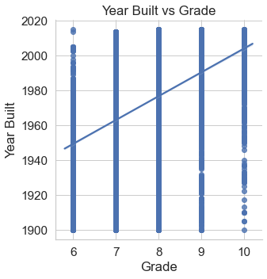
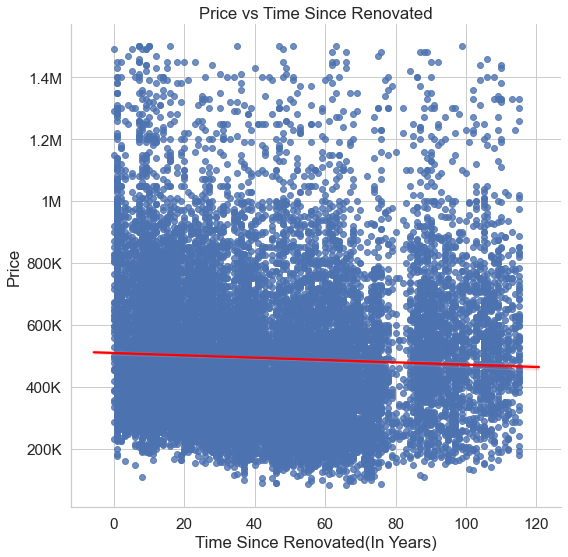
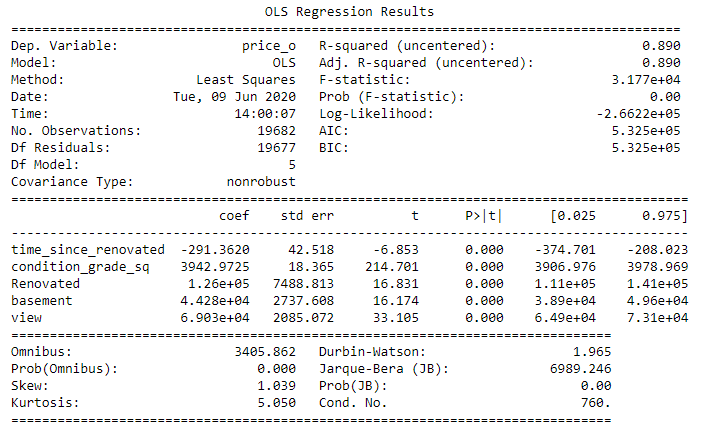
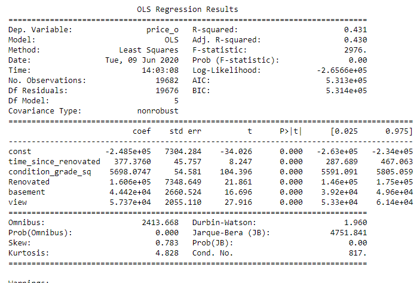

# Housing data investigation and modeling
## Realty Kings

* [Presentation](./Presentation/Realty_Kings.pdf)
* [Presentation Video](./Video/Vid_Pres.mp4)
* [Blog](https://medium.com/@saifkasmani84/housing-data-investigation-and-linear-regression-modeling-6a809d1a1f72)

## Goal
Given housing data for Kings County Seattle, to find price predictors and create a linear regression model capable of predicting potential prices for new homes. This README shall also serve as a genreal outline and explanation of the analysis and devolpment process.

## Outline

An exploration into distances did find some interesting trends that warrant further investigation and after numerous tried and failed attempts at using recursive feature elimination we settled on standard feature selection for our final model. While initially the model seemed promising, further investigation revealed our perceived model score to be artifically high due to the lack of a constant in the model.

## Analysis

[Primary data used](./Data/kc_house_data.csv)

### First
Our initial investigation looked at the relationship between house grade and house price [here.](./EDA/EDAs.ipynb)

As we can see, there does appear to be a linear relationship with higher house grades and higher sale price.
____________________________________

### Second
We then looked into the affects of renovation and if more recent renovations had a stronger effect on the sale price of the house

While not a strong relationship with our data, it was interesting to see that there did appear to be a slight trend with more recently renovated homes tending to have a slightly higher possible selling price than those that were renovated longer ago.
____________________________________

### Third
Due to the lack of information of waterfront properties, we were curious if the houses proximity to water would have an effect on the sale price as well as the houses distance from downtown Seattle, which we investigated [here](./EDA/Distance_from_hotspot.ipynb)

There did indeed appear to be a correlation between the price of a house and its distance from Seattle, with houses that were closer to the city tending to have higher price possibilities.

## Modeling

Checked for multicollinearity [here](./Model/Multicolinearity_check.ipynb)

Used Recursive Feature Elimination [here](./Model/Recursive_feature_elimination_model.ipynb)

While not all models were saved, numerous attempts were made with various adjustments that all seemed to provide similiar or diminishing results. High amounts of multicollinearity seemed unavoidable with this method.

Eventually we settled on our [final model.](./Model/Final_Model.ipynb)
At first glance, it looked like we had finally made a great model for our provided data!

However, further investigation showed that our test results weren't matching up with each other. Essentially we had forgotten to include a constant in our model as a house will never sell for $0. After including the constant we got a much different result that confirmed what our initial test results were trying to tell us.

## Conclusion

Our investigation showed that numerous factors can influence the price of a house. Based off of our main investigations we can recommend rennovating the house before selling to provide a small improvement before selling, and if that renovation provides you with an opportunity to add square footage or additional rooms, it would be wise to do so in order to maximize the potential selling price. 
